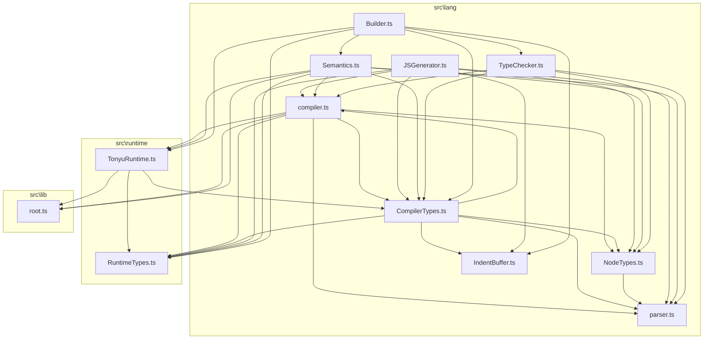

# TypeScript Graph

```bash
tsg src/lang/compiler
```


```mermaid
flowchart
    subgraph src\lang["src\lang"]
        src/lang/compiler.ts["compiler.ts"]
        src/lang/CompilerTypes.ts["CompilerTypes.ts"]
        src/lang/NodeTypes.ts["NodeTypes.ts"]
        src/lang/parser.ts["parser.ts"]
        src/lang/IndentBuffer.ts["IndentBuffer.ts"]
        src/lang/JSGenerator.ts["JSGenerator.ts"]
        src/lang/Semantics.ts["Semantics.ts"]
        src/lang/TypeChecker.ts["TypeChecker.ts"]
        src/lang/Builder.ts["Builder.ts"]
    end
    subgraph src\runtime["src\runtime"]
        src/runtime/TonyuRuntime.ts["TonyuRuntime.ts"]
        src/runtime/RuntimeTypes.ts["RuntimeTypes.ts"]
    end
    subgraph src\lib["src\lib"]
        src/lib/root.ts["root.ts"]
    end
    src/lang/compiler.ts-->src/runtime/TonyuRuntime.ts
    src/lang/compiler.ts-->src/lib/root.ts
    src/lang/compiler.ts-->src/lang/NodeTypes.ts
    src/lang/compiler.ts-->src/lang/CompilerTypes.ts
    src/lang/compiler.ts-->src/runtime/RuntimeTypes.ts
    src/lang/compiler.ts-->src/lang/parser.ts
    src/lang/CompilerTypes.ts-->src/runtime/RuntimeTypes.ts
    src/lang/CompilerTypes.ts-->src/lang/compiler.ts
    src/lang/CompilerTypes.ts-->src/lang/IndentBuffer.ts
    src/lang/CompilerTypes.ts-->src/lang/NodeTypes.ts
    src/lang/CompilerTypes.ts-->src/lang/parser.ts
    src/runtime/TonyuRuntime.ts-->src/lang/CompilerTypes.ts
    src/lang/JSGenerator.ts-->src/lang/compiler.ts
    src/lang/JSGenerator.ts-->src/lang/CompilerTypes.ts
    src/lang/Semantics.ts-->src/lang/compiler.ts
    src/lang/Semantics.ts-->src/lang/CompilerTypes.ts
    src/lang/TypeChecker.ts-->src/lang/compiler.ts
    src/lang/TypeChecker.ts-->src/lang/CompilerTypes.ts
    src/lang/Builder.ts-->src/lang/CompilerTypes.ts
    src/lang/NodeTypes.ts-->src/lang/parser.ts
    src/runtime/TonyuRuntime.ts-->src/lib/root.ts
    src/runtime/TonyuRuntime.ts-->src/runtime/RuntimeTypes.ts
    src/lang/JSGenerator.ts-->src/lang/IndentBuffer.ts
    src/lang/JSGenerator.ts-->src/lang/NodeTypes.ts
    src/lang/JSGenerator.ts-->src/lang/parser.ts
    src/lang/JSGenerator.ts-->src/runtime/RuntimeTypes.ts
    src/lang/Semantics.ts-->src/runtime/TonyuRuntime.ts
    src/lang/Semantics.ts-->src/lib/root.ts
    src/lang/Semantics.ts-->src/lang/parser.ts
    src/lang/Semantics.ts-->src/lang/NodeTypes.ts
    src/lang/Semantics.ts-->src/runtime/RuntimeTypes.ts
    src/lang/TypeChecker.ts-->src/lang/NodeTypes.ts
    src/lang/TypeChecker.ts-->src/lang/parser.ts
    src/lang/Builder.ts-->src/runtime/TonyuRuntime.ts
    src/lang/Builder.ts-->src/lang/IndentBuffer.ts
    src/lang/Builder.ts-->src/lang/Semantics.ts
    src/lang/Builder.ts-->src/lang/TypeChecker.ts
    src/lang/Builder.ts-->src/runtime/RuntimeTypes.ts
```
